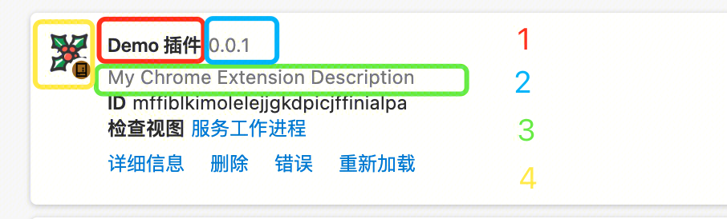
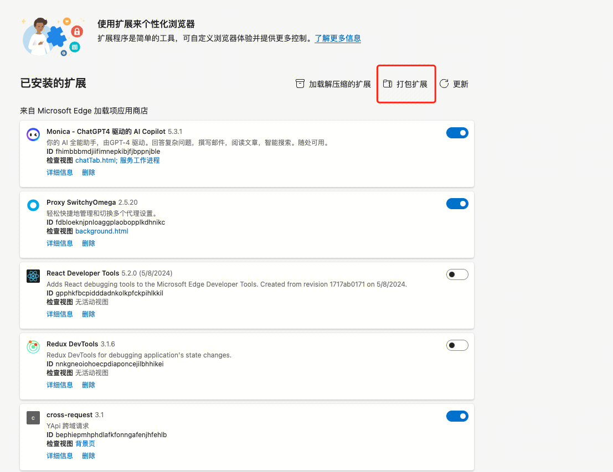
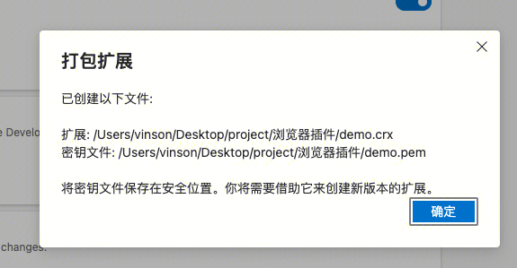
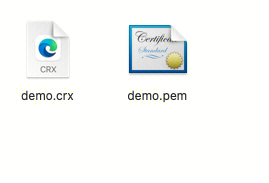
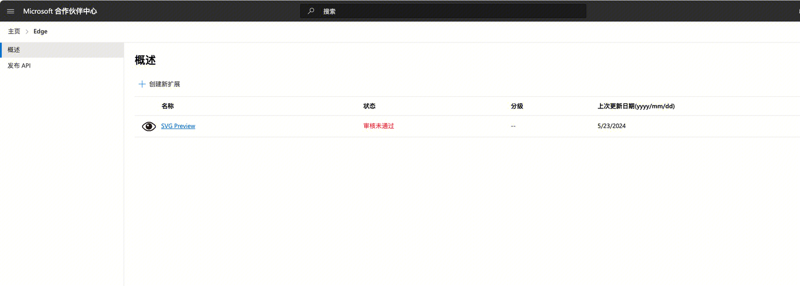

Chrome浏览器插件开发是一种基于谷歌Chrome浏览器的扩展程序开发。通过创建插件，开发者可以为用户提供额外的功能，以增强浏览器的使用体验。本文将介绍Chrome浏览器插件开发的基本流程、相关技术和工具。

不光是chrome浏览器，包括opera、edge以及360等浏览器都已经切换至chromium内核，所以都支持使用chrome浏览器插件。同时通过插件，用户可以定制自己的浏览器，添加各种实用功能，如广告拦截（adblock）、翻译工具（谷歌翻译）、密码管理（Dashlane）等。

1. Chrome浏览器插件可以做什么
1. 插件的展示形式
大多数扩展程序都需要某种类型的用户互动才能正常运行。扩展程序平台提供了多种方式来向您的扩展程序添加互动。

浏览器插件的主要展示形式有很多形式例如：

工具栏按钮：这是最常见的形式之一。插件会在浏览器的工具栏上添加一个图标，用户可以点击这个图标来访问插件的功能或设置。例如，Adblock Plus和Grammarly等插件都使用这种方式。弹出窗口：当用户点击工具栏按钮时，插件可以显示一个弹出窗口（Popup），这个窗口可以包含各种用户界面元素，如按钮、输入框、菜单等，用于与用户交互。

侧边栏：有些插件会在浏览器的侧边栏中显示其界面，这种形式通常用于需要持续显示信息或工具的插件。例如，Evernote Web Clipper和OneNote Web Clipper等插件。

页面内嵌内容：插件可以直接在当前网页上嵌入内容或修改网页的DOM结构。例如，翻译插件可以在网页上直接显示翻译结果，广告拦截插件可以隐藏广告元素。

背景页（Background Page）：一些插件会在后台运行一个隐藏的页面，用于处理长时间运行的任务或保持与服务器的持续通信。用户通常不会直接与背景页交互，但它可以支持插件的其他部分。

上下文菜单：插件可以在右键菜单中添加自定义选项，允许用户在特定元素上使用插件的功能。例如，右键点击图片时，可以选择通过某个插件下载或分享图片。

通知：插件可以使用浏览器的通知系统向用户发送通知。这种形式通常用于提醒用户某些事件或状态变化，例如邮件通知插件会在收到新邮件时发送通知。

新标签页或主页改造：一些插件会修改浏览器的新标签页或主页，以展示特定的信息或功能。例如，一些生产力插件会在新标签页显示待办事项列表、日历等。

2. 控制浏览器
借助 Chrome 的扩展程序 API，可以改变浏览器的工作方式：

覆盖 Chrome 页面和设置项：Manifest.json 配置 chrome_settings_overrides

扩展开发者工具：Manifest.json 配置 devtools_page

显示通知：chrome.notifications API

管理历史记录：chrome.history API

控制标签页和窗口：chrome.tabs、chrome.tabGroups 和 chrome.windows 等 API

键盘快捷键：chrome.commands API

身份认证：chrome.identity API

管理插件：chrome.management API

提供建议：chrome.omnibox API

更新 Chrome 设置：chrome.proxy API

下载管理：chrome.downloads API

书签：chrome.bookmarks API

...

3. 控制页面与网络
可以通过注入脚本、拦截网络请求以及使用 Web API 与网页进行交互，来控制和修改 Web：

注入 JS 和 CSS 文件

访问当前 Tab 页

控制 Web 请求

录音和屏幕截图

修改网站设置 等等

2. Chrome浏览器插件的基本结构
Chrome浏览器插件主要由以下四个部分组成：

manifest.json：插件的元数据文件，包含了插件的名称、版本、权限等信息。

popup.html：插件的弹出窗口HTML文件，用于展示插件的内容。

popup.js：插件的JavaScript代码文件，用于处理用户的交互事件。

styles.css：插件的CSS样式文件，用于美化插件的界面。

1.Manifest（清单）
Chrome 插件的清单是唯一且必须具有特定文件名的必需文件：manifest.json；该文件列出了有关该扩展程序的结构和行为的重要信息。

{
  "manifest_version": 3,
  "name": "Demo 插件",
  "version": "0.0.1",
  "description": "My Chrome Extension Description",
  "icons": {
    "16": "icons/icon16.png",
    "48": "icons/icon48.png",
    "128": "icons/icon128.png"
  },
}

1
{
2
  "manifest_version": 3,
3
  "name": "Demo 插件",
4
  "version": "0.0.1",
5
  "description": "My Chrome Extension Description",
6
  "icons": {
7
    "16": "icons/icon16.png",
8
    "48": "icons/icon48.png",
9
    "128": "icons/icon128.png"
10
  },
11
}
12
​
1.1必填字段
manifest_version：用于指定扩展程序使用的清单文件格式版本，目前是 3，从2019年以后chrome就开始支持3版本的拆件

name：插件名称，一般情况下 hover 插件图标展示的文案也是 name

version：插件版本

1.2发布 应用商店需要的字段
name

version

description

icons

2.Action（操作项）
控制扩展程序在 Chrome 浏览器工具栏中的配置。

1
{
2
  "manifest_version": 3,
3
  "name": "Demo 插件",
4
  "version": "0.0.1",
5
  "description": "My Chrome Extension Description",
6
  "icons": {
7
    "16": "icons/icon16.png",
8
    "48": "icons/icon48.png",
9
    "128": "icons/icon128.png"
10
  },
11
  "action": {
12
    "default_icon": "icons/icon.png",
13
    "default_title": "Demo default_title",
14
    "default_popup": "popup/index.html"
15
  },
16
}

default_icon：工具栏展示的图片

default_title：hover 插件图标展示的文案

default_popup：点击图标弹出的页面

 

3.Content scripts（内容脚本）
在宿主网页环境中运行 JavaScript 或 CSS。 通过 content_scripts 进行注册。

1
{
2
  "manifest_version": 3,
3
  "name": "Demo 插件",
4
  "version": "0.0.1",
5
  "description": "My Chrome Extension Description",
6
  "icons": {
7
    "16": "icons/icon16.png",
8
    "48": "icons/icon48.png",
9
    "128": "icons/icon128.png"
10
  },
11
  "content_scripts": [
12
    {
13
      "matches": ["https://git.woa.com/*"],
14
      "js": ["content/index.js"],
15
      "css": ["content/index.css"]
16
    }
17
  ]
18
}
19
​
 

 

 

4.Background - Service Worker(背景)
Service Worker 在后台运行并处理浏览器事件

1
{
2
  "manifest_version": 3,
3
  "name": "Demo 插件",
4
  "version": "0.0.1",
5
  "description": "My Chrome Extension Description",
6
  "icons": {
7
    "16": "icons/icon16.png",
8
    "48": "icons/icon48.png",
9
    "128": "icons/icon128.png"
10
  },
11
  "action": {
12
    "default_icon": "icons/icon.png",
13
    "default_title": "Demo default_title",
14
    "default_popup": "popup/index.html"
15
  },
16
  "background": {
17
    "service_worker": "background/service_worker.js",
18
    "type": "module"
19
  },
20
}
21
​
1.1 激活态

 

1.2 无效状态

 

浏览器为了减少内存跟性能消耗，会让插件在用户停止交互、页面关闭或刷新、任务完成或定时任务结束时会从活跃变为不活跃。

单个请求的处理用时超过 5 分钟。

fetch 响应的传递时间超过 30 秒时

5.结构示意

 
3. 插件开发流程
Chrome浏览器插件开发的基本流程：

1.配置Manifest.json

1
{
2
  "manifest_version": 3,
3
  "name": "Demo 插件",
4
  "version": "0.0.1",
5
  "description": "My Chrome Extension Description",
6
  "icons": {
7
    "16": "icons/icon16.png",
8
    "48": "icons/icon48.png",
9
    "128": "icons/icon128.png"
10
  },
11
  "action": {
12
    "default_icon": "icons/icon.png",
13
    "default_title": "Demo default_title",
14
    "default_popup": "popup/index.html"
15
  },
16
  "side_panel": {
17
    "default_path": "popup/index.html"
18
  },
19
  "background": {
20
    "service_worker": "background/service_worker.js",
21
    "type": "module"
22
  },
23
  "permissions": [
24
    "activeTab",
25
    "sidePanel",
26
    "notifications"
27
  ],
28
  "content_scripts": [
29
    {
30
      "matches": ["https://git.woa.com/*"],
31
      "js": ["content/index.js"],
32
      "css": ["content/index.css"]
33
    }
34
  ]
35
}
36
​
2.添加popup.html

1
<!DOCTYPE html>
2
<html lang="en">
3
<head>
4
  <meta charset="UTF-8">
5
  <meta name="viewport" content="width=device-width, initial-scale=1.0">
6
  <title>Document</title>
7
  <link rel="stylesheet" href="./index.css">
8
</head>
9
<body>
10
  

11
      

12
          <input id="plugin_search_inp" />
13
          <input id="plugin_search_but" type="button" value="翻译" />
14
      

15
      

16
          翻译此页面
17
      

18
  

19
  
20
  

21
      © 2015 Google -
22
      <a target="_blank" href="https://google.com/">扩展程序选项</a>
23
      <a target="_blank" href="https://translate.google.com/?source=gtx">Google 翻译</a>
24
  

25
</body>
26

27
</html>
28
​
3.添加background

代码解释

代码改写
1
// part1 （模块化引入）
2
import './module_1.js'
3
import './module_2.js'
4
​
5
// part2  （调用chrome内核消息推送）
6
chrome.runtime.onMessage.addListener(async (message, sender, sendResponse) => {
7
  if (message.action === 'fromPopup') {
8
    chrome.notifications.create(
9
      {
10
        type: "basic",
11
        title: "Notifications Title",
12
        message: "Notifications message to display",
13
        iconUrl: "../icons/icon.png"
14
      },
15
      (notificationId) => {
16
        console.log('notificationId-->', notificationId)
17
      }
18
    );
19
  }
20
  if (message.action === 'fromContent') {
21
    chrome.notifications.create(
22
      {
23
        type: "basic",
24
        title: "Notifications Title",
25
        message: "Notifications message to display",
26
        iconUrl: "../icons/icon.png"
27
      },
28
      (notificationId) => {
29
        console.log('notificationId-->', notificationId)
30
      }
31
    );
32
  }
33
  
34
});
35
​
tips：mac下的提示是通过mac自身的消息推送的，所以要打开设置中关于浏览器消息的推送开关

4.content（内容脚本注入）

代码解释

代码改写
1
// part1 获取content 页面的上下文
2
// console.log('this is content js')
3
// console.log('document', document)
4
// console.log('location', location)
5
// console.log('window', window)
6
​
7
// https://git.woa.com/djt/merchant-console
8
​
9
// part2 （往页面上注入元素）
10
var targetElement = document.querySelectorAll('.tw-mb-3>div')[1];
11
// 创建一个新的 input 元素
12
var input = document.createElement('input');
13
​
14
input.className = 'git-input';
15
input.type = 'text';
16
input.placeholder = '直接输入文件路径';
17
targetElement.insertBefore(input, targetElement.firstChild);
18
​
19
input.addEventListener('keydown', function(event) {
20
    if (event.key === 'Enter' || event.keyCode === 13) {
21
        var inputValue = input.value;
22
        // src/Router/Merchant/Ecommerce/EcommerceDomain/Create/index.tsx
23
        var targetUrl = 'https://git.woa.com/djt/merchant-console/blob/develop/' + inputValue;
24
        window.location.href = targetUrl;
25
    }
26
});
27
​
28
// 将按钮添加到目标元素中
29
targetElement.insertBefore(input, targetElement.firstChild);
30
​
5.content与background通信

代码解释

代码改写
1
// part3 页面通信
2
var targetElement = document.querySelectorAll('.tw-mb-3>div')[1];
3
// 创建一个新的 input 元素
4
var button = document.createElement('button');
5
​
6
button.className = 'git-button';
7
button.innerHTML = '页面通信';
8
targetElement.insertBefore(button, targetElement.firstChild);
9
​
10
button.addEventListener('click', function() {
11
    chrome.runtime.sendMessage({action: "fromContent"});
12
});
13
​
14
// 将按钮添加到目标元素中
15
targetElement.insertBefore(button, targetElement.firstChild);
16
​
17
​

6.popup.html与content通信

代码解释

代码改写
1
const plugin_search_but = document.getElementById('plugin_search_but')
2
const plugin_search_inp = document.getElementById('plugin_search_inp')
3
plugin_search_but.onclick = function () {
4
    // alert('输入的值为：' + plugin_search_inp.value.trim())
5
    console.log('chrome', chrome)
6
    chrome.runtime.sendMessage({
7
        action: 'fromPopup',
8
        message: 'Hello from Popup!'
9
    });
10
}
11
​
 

 

7.fetch请求

代码解释

代码改写
1
var targetElement = document.querySelectorAll('.tw-mb-3>div')[1];
2
// 创建一个新的 input 元素
3
var button = document.createElement('button');
4
​
5
button.className = 'git-button';
6
button.innerHTML = '接口请求';
7
targetElement.insertBefore(button, targetElement.firstChild);
8
​
9
button.addEventListener('click', function () {
10
    fetch('http://localhost:3000/today-date')
11
        .then(response => response.json())
12
        .then(data => {
13
            console.log(data);
14
            const { date } = data;
15
            var targetElement = document.querySelectorAll('.tw-mb-3>div')[1];
16
            // 创建一个新的 input 元素
17
            var span = document.createElement('span');
18
​
19
            span.innerHTML = `今天的日期是：${date}`;
20
            targetElement.insertBefore(span, targetElement.firstChild);
21
​
22
        })
23
        .catch(error => console.error('Error:', error));
24
});
25
​
26
// 将按钮添加到目标元素中
27
targetElement.insertBefore(button, targetElement.firstChild);
4.打包Chrome插件

